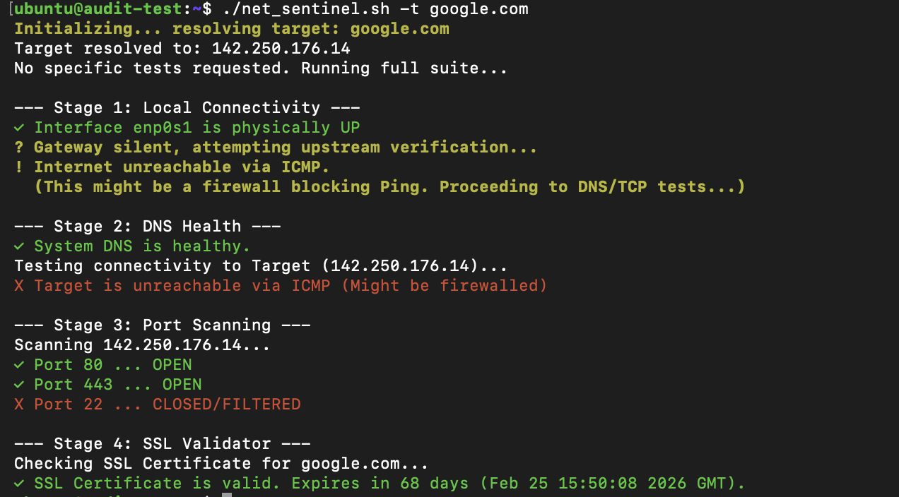
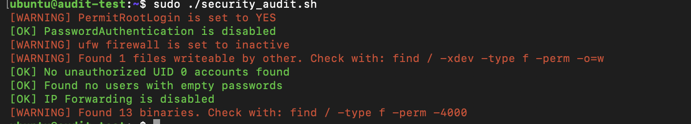

# Bash Utility Scripts

A collection of useful Bash scripts for system administration and diagnostics.

## 1. Network Diagnostics Tool (`net_sentinel.sh`)

A comprehensive, strict-mode Bash script designed to automate network troubleshooting. It performs a 4-stage health check ranging from local interface connectivity to SSL certificate validation.

### Features
*   **Stage 1: Local Connectivity** - Checks physical link state, IP configuration, Gateway reachability, and ICMP upstream access.
*   **Stage 2: DNS Health** - Validates local system DNS and upstream connectivity (Google DNS) to identify resolution issues.
*   **Stage 3: Port Scanner** - Scans target ports (Default: 80, 443, 22) or user-defined ports.
*   **Stage 4: SSL Validator** - Checks if the SSL certificate is valid and calculates days until expiration.
*   **Logging** - Optional support to output results to a file while displaying them on screen.

### Prerequisites
This script is designed primarily for **Linux** systems (Debian/Ubuntu/CentOS).
*   **Dependencies:** `netcat`, `dnsutils` (dig), `iproute2` (ip), `openssl`, `ping`.

To install dependencies on Ubuntu/Debian:
```bash
sudo apt update
sudo apt install dnsutils netcat openssl iproute2
```
### Usage
Make the script executable
```bash
chmod u+x net_sentinel.sh
```

### Basic Syntax
```bash
./net_sentinel.sh -t <TARGET> [options] [modules]
```
### Options
| Flag | Description                   | Required? | Default   |
|------|-------------------------------|-----------|-----------|
| -t   | Target Domain or IP Address   | Yes       | N/a       |
| -p   | Comma Seperated Ports to Scan | No        | 80,443,22 |
| -h   | Show Help Menu                | No        | N/A       |
| -o   | Output File Name              | No        | N/A       |

### Examples
1. #### Run a full diagnostic on a domain
```bash
./net_sentinel.sh -t google.com
```
2. #### Scan specific ports on a server
```bash
/net_sentinel.sh -t 192.168.1.50 -p 22,8080,3000
```
3. #### Run diagnostics and save the log to a file
```bash
./net_sentinel.sh -t example.com -o network_report.txt
```
4. #### Run only specific stages (Modular Execution)
You can run specific tests by adding the stage name at the end of the command: local, dns, ports, or ssl.
```bash
./net_sentinel.sh -t example.com dns ssl
```

### Example output


## 2. Network Hardening Tool
A security hardening tool designed for server auditing. Checking for various misconfigurations that can serve as attack vectors

### Features
* **SSH auditing** - Checks for misconfigured SSH settings
* **Firewall** - Can detect if a UFW firewall is active or inactive
*  **File/User Permission** - Checks for world writeable files, SUID binaries, non-root users with UID 0, and empty password accounts
* **Network Auditing** - Can audit for IP forwarding

### Prerequisites
Script is primarily designed for **Linux** systems. Currently, the firewall test only probes the status of `ufw`

### Usage
Make the script executable. **Must run script with sudo/root privileges**
```bash
chmod u+x security_audit.sh
```

### Basic Syntax
```bash
sudo ./security_audit.sh
```

### Example output


## Disclaimer
This tool is developed for educational purposes and authorized security testing only. The developer is not responsible for any misuse or damage caused by this tool. Always obtain permission before auditing a network you do not own
